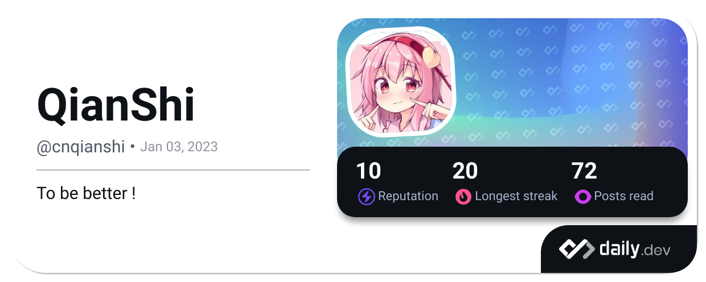

<p align="center">
  <a href="https://cnqs.moe/"></a>
</p>

<p align="center">
  
</p>

<p align="center">
<a title="Hits" target="_blank" href="https://github.com/okatu-loli/okatu-loli"></a>
<a title="github" target="_blank" href="https://github.com/okatu-loli"></a>
</p>

### Hi there👏 I'm QianShi, a developer

- ❤️ Favoring Coding💻 Thinking Philosophy📕, loving the life🥖

- 👨‍💻 All of my projects are available at Github

- 📝 I regularly write articles on [https://cnqs.moe/](https://cnqs.moe/)

- 💬 Ask me about **Golang, Python, Git, Linux ect.**

- 📫 How to reach me: (QQ)1835038031 (Mail)okatu@cnqs.moe

- I'm looking forward to meeting **you**!ヾ(≧▽≦*)o


<table>
<tr>
<td valign="top" width="54%">


</td>

<td valign="top" width="46%">


</td>
</tr>
</table>

bar_chart: [Coding hours per month](https://github.com/muety/wakapi)
<!--START_SECTION:waka-->

```txt
Go           0 hrs 33 mins   🟩🟩🟩🟩🟩🟩🟩🟩🟩🟩🟩🟩⬜⬜⬜⬜⬜⬜⬜⬜⬜⬜⬜⬜⬜   47.10 %
Markdown     0 hrs 25 mins   🟩🟩🟩🟩🟩🟩🟩🟩🟩⬜⬜⬜⬜⬜⬜⬜⬜⬜⬜⬜⬜⬜⬜⬜⬜   36.14 %
Json         0 hrs 5 mins    🟩🟨⬜⬜⬜⬜⬜⬜⬜⬜⬜⬜⬜⬜⬜⬜⬜⬜⬜⬜⬜⬜⬜⬜⬜   06.64 %
Textmate     0 hrs 4 mins    🟩🟨⬜⬜⬜⬜⬜⬜⬜⬜⬜⬜⬜⬜⬜⬜⬜⬜⬜⬜⬜⬜⬜⬜⬜   05.28 %
Go.mod       0 hrs 3 mins    🟩⬜⬜⬜⬜⬜⬜⬜⬜⬜⬜⬜⬜⬜⬜⬜⬜⬜⬜⬜⬜⬜⬜⬜⬜   03.91 %
```

<!--END_SECTION:waka-->

<a href="https://app.daily.dev/cnqianshi"></a>
</a>
